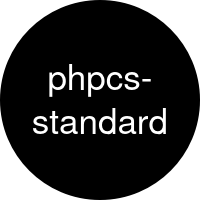

  

<h1 align="center">Few lines describing your project</h1>

---

## Features

- Your first feature as a list item
- Your second feature as a list item
- Your third feature as a list item

## Installation

    composer require --dev drevops/phpcs-standard

### CLI options

| Name        | Default value | Description                        |
|-------------|---------------|------------------------------------|
| `arg1`      |               | Description of the first argument. |
| `--option1` | `default1`    | Option with a default value.       |
| `--option2` | None          | Option wihtout a value.            |

## Maintenance

    composer install
    composer lint
    composer test

---
_This repository was created using the [phpcs-standard](https://getphpcs-standard.dev/) project template_
