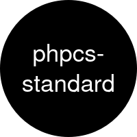

<p align="center">
  <a href="" rel="noopener">
  </a>
</p>

<h1 align="center">DrevOps PHP_CodeSniffer Standard</h1>

<div align="center">

[](https://github.com/drevops/phpcs-standard/issues)
[](https://github.com/drevops/phpcs-standard/pulls)
[](https://github.com/drevops/phpcs-standard/actions/workflows/test-php.yml)
[](https://codecov.io/gh/drevops/phpcs-standard)


[](https://github.com/drevops/vortex)
</div>

---
[PHP_CodeSniffer](https://github.com/squizlabs/PHP_CodeSniffer) standard enforcing:
- Consistent naming conventions for local variables and function/method parameters (configurable: `snakeCase` or `camelCase`)
- PHPUnit data provider naming conventions and organization

## Installation

```bash
composer require --dev drevops/phpcs-standard
```

The standard is automatically registered via [phpcodesniffer-composer-installer](https://github.com/PHPCSStandards/composer-installer).

Verify: `vendor/bin/phpcs -i` (should list `DrevOps`)

## Usage

```bash
# Check code
vendor/bin/phpcs --standard=DrevOps path/to/code

# Auto-fix
vendor/bin/phpcbf --standard=DrevOps path/to/code
```

## Configuration

Create `phpcs.xml`:

```xml
<?xml version="1.0"?>
<ruleset name="Project Standards">
  <rule ref="DrevOps"/>
  <file>src</file>
  <file>tests</file>
</ruleset>
```

Use individual sniffs:

```xml
<ruleset name="Custom Standards">
  <!-- Naming Conventions -->
  <rule ref="DrevOps.NamingConventions.LocalVariableNaming"/>
  <rule ref="DrevOps.NamingConventions.ParameterNaming"/>

  <!-- Testing Practices -->
  <rule ref="DrevOps.TestingPractices.DataProviderPrefix"/>
  <rule ref="DrevOps.TestingPractices.DataProviderMatchesTestName"/>
  <rule ref="DrevOps.TestingPractices.DataProviderOrder"/>
</ruleset>
```

### Configure naming convention

By default, both sniffs enforce `snakeCase`. Configure to use `camelCase`:

```xml
<ruleset name="Custom Standards">
  <rule ref="DrevOps.NamingConventions.LocalVariableNaming">
    <properties>
      <property name="format" value="camelCase"/>
    </properties>
  </rule>

  <rule ref="DrevOps.NamingConventions.ParameterNaming">
    <properties>
      <property name="format" value="camelCase"/>
    </properties>
  </rule>
</ruleset>
```

## `LocalVariableNaming`

Enforces consistent naming convention for local variables inside functions/methods.

**With `snakeCase` (default):**
```php
function processOrder() {
    $order_id = 1;        // ✓ Valid
    $orderId = 1;         // ✗ Error: NotSnakeCase
}
```

**With `camelCase`:**
```php
function processOrder() {
    $orderId = 1;         // ✓ Valid
    $order_id = 1;        // ✗ Error: NotCamelCase
}
```

Excludes:
- Function/method parameters (handled by `ParameterNaming`)
- Class properties (not enforced)
- Reserved variables (`$this`, `$_GET`, `$_POST`, etc.)

### Error codes

- `DrevOps.NamingConventions.LocalVariableNaming.NotSnakeCase` (when `format="snakeCase"`)
- `DrevOps.NamingConventions.LocalVariableNaming.NotCamelCase` (when `format="camelCase"`)

### Ignore

```php
// phpcs:ignore DrevOps.NamingConventions.LocalVariableNaming.NotSnakeCase
$myVariable = 'value';
```

## `ParameterNaming`

Enforces consistent naming convention for function/method parameters.

**With `snakeCase` (default):**
```php
function processOrder($order_id, $user_data) {  // ✓ Valid
function processOrder($orderId, $userData) {    // ✗ Error: NotSnakeCase
```

**With `camelCase`:**
```php
function processOrder($orderId, $userData) {    // ✓ Valid
function processOrder($order_id, $user_data) {  // ✗ Error: NotCamelCase
```

Excludes:
- Parameters inherited from interfaces/parent classes
- Parameters in interface/abstract method declarations
- Class properties (including promoted constructor properties)

### Error codes

- `DrevOps.NamingConventions.ParameterNaming.NotSnakeCase` (when `format="snakeCase"`)
- `DrevOps.NamingConventions.ParameterNaming.NotCamelCase` (when `format="camelCase"`)

### Ignore

```php
// phpcs:ignore DrevOps.NamingConventions.ParameterNaming.NotSnakeCase
function process($legacyParam) {}
```

## `DataProviderPrefix`

Enforces consistent naming prefix for PHPUnit data provider methods.

```php
class MyTest extends TestCase {
    /**
     * @dataProvider dataProviderUserLogin
     */
    public function testUserLogin($data) {}

    public function dataProviderUserLogin() {  // ✓ Valid
        return [];
    }

    public function providerUserLogin() {      // ✗ Error: InvalidPrefix
        return [];
    }
}
```

### Configuration

Customize the required prefix:

```xml
<rule ref="DrevOps.TestingPractices.DataProviderPrefix">
    <properties>
        <property name="prefix" value="dataProvider"/>
    </properties>
</rule>
```

### Error code

`DrevOps.TestingPractices.DataProviderPrefix.InvalidPrefix`

### Ignore

```php
// phpcs:ignore DrevOps.TestingPractices.DataProviderPrefix.InvalidPrefix
public function providerCustom() {}
```

### Auto-fixing

This sniff supports auto-fixing with `phpcbf`:
- Renames provider methods to use the correct prefix
- Updates all `@dataProvider` annotations to reference the new name

## `DataProviderMatchesTestName`

Ensures data provider method names match their test method names.

```php
class MyTest extends TestCase {
    /**
     * @dataProvider dataProviderUserLogin
     */
    public function testUserLogin($data) {}

    public function dataProviderUserLogin() {  // ✓ Valid - ends with "UserLogin"
        return [];
    }

    public function dataProviderLogin() {      // ✗ Error: InvalidProviderName
        return [];                              //   Expected: ends with "UserLogin"
    }
}
```

Supported formats:
- `@dataProvider` annotations
- `#[DataProvider('methodName')]` attributes (PHP 8+)

Excludes:
- External providers (`ClassName::methodName`)
- Non-test methods
- Non-test classes

### Error code

`DrevOps.TestingPractices.DataProviderMatchesTestName.InvalidProviderName`

### Ignore

```php
// phpcs:ignore DrevOps.TestingPractices.DataProviderMatchesTestName.InvalidProviderName
public function dataProviderCustomName() {}
```

## `DataProviderOrder`

Enforces structural organization of test and data provider methods.

```php
class MyTest extends TestCase {
    // ✓ Valid - provider after test (default)
    /**
     * @dataProvider dataProviderUserLogin
     */
    public function testUserLogin($data) {}

    public function dataProviderUserLogin() {
        return [];
    }
}
```

Helper methods between tests and providers are allowed:

```php
class MyTest extends TestCase {
    /**
     * @dataProvider dataProviderUserLogin
     */
    public function testUserLogin($data) {}

    private function helperMethod() {}  // ✓ Allowed

    public function dataProviderUserLogin() {
        return [];
    }
}
```

### Configuration

Reverse the ordering (provider before test):

```xml
<rule ref="DrevOps.TestingPractices.DataProviderOrder">
    <properties>
        <property name="providerPosition" value="before"/>
    </properties>
</rule>
```

Options:
- `after` (default) - Providers must appear after their test methods
- `before` - Providers must appear before their test methods

### Error codes

- `DrevOps.TestingPractices.DataProviderOrder.ProviderBeforeTest` - Provider appears before test (when `providerPosition="after"`)
- `DrevOps.TestingPractices.DataProviderOrder.ProviderAfterTest` - Provider appears after test (when `providerPosition="before"`)

### Ignore

```php
// phpcs:ignore DrevOps.TestingPractices.DataProviderOrder.ProviderBeforeTest
public function dataProviderUserLogin() {}
```

## Development

```bash
composer install       # Install dependencies
composer test          # Run tests
composer test-coverage # Run tests with coverage
composer lint          # Check code standards
composer lint-fix      # Fix code standards
```

## License

GPL-3.0-or-later

---
_This repository was created using the [Scaffold](https://getphpcs-standard.dev/) project template_
