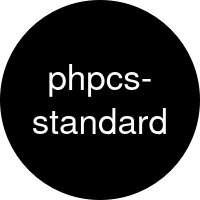

<p align="center">
  <a href="" rel="noopener">
  </a>
</p>

<h1 align="center">DrevOps PHP_CodeSniffer Standard</h1>

<div align="center">

[](https://github.com/drevops/phpcs-standard/issues)
[](https://github.com/drevops/phpcs-standard/pulls)
[](https://github.com/drevops/phpcs-standard/actions/workflows/test-php.yml)
[](https://codecov.io/gh/drevops/phpcs-standard)


[](https://github.com/drevops/vortex)
</div>

---
[PHP_CodeSniffer](https://github.com/squizlabs/PHP_CodeSniffer) standard enforcing:
- Consistent naming conventions for local variables and function/method parameters (configurable: `snakeCase` or `camelCase`)
- PHPUnit data provider naming conventions and organization

## Installation

```bash
composer require --dev drevops/phpcs-standard
```

The standard is automatically registered via [phpcodesniffer-composer-installer](https://github.com/PHPCSStandards/composer-installer).

Verify: `vendor/bin/phpcs -i` (should list `DrevOps`)

## Usage

```bash
# Check code
vendor/bin/phpcs --standard=DrevOps path/to/code

# Auto-fix
vendor/bin/phpcbf --standard=DrevOps path/to/code
```

## Configuration

Create `phpcs.xml`:

```xml
<?xml version="1.0"?>
<ruleset name="Project Standards">
  <rule ref="DrevOps"/>
  <file>src</file>
  <file>tests</file>
</ruleset>
```

Use individual sniffs:

```xml
<ruleset name="Custom Standards">
  <!-- Naming Conventions -->
  <rule ref="DrevOps.NamingConventions.LocalVariableNaming"/>
  <rule ref="DrevOps.NamingConventions.ParameterNaming"/>

  <!-- Testing Practices -->
  <rule ref="DrevOps.TestingPractices.DataProviderPrefix"/>
  <rule ref="DrevOps.TestingPractices.DataProviderMatchesTestName"/>
  <rule ref="DrevOps.TestingPractices.DataProviderOrder"/>
</ruleset>
```

### Configure naming convention

By default, both sniffs enforce `snakeCase`. Configure to use `camelCase`:

```xml
<ruleset name="Custom Standards">
  <rule ref="DrevOps.NamingConventions.LocalVariableNaming">
    <properties>
      <property name="format" value="camelCase"/>
    </properties>
  </rule>

  <rule ref="DrevOps.NamingConventions.ParameterNaming">
    <properties>
      <property name="format" value="camelCase"/>
    </properties>
  </rule>
</ruleset>
```

## `LocalVariableNaming`

Enforces consistent naming convention for local variables inside functions/methods.

**With `snakeCase` (default):**
```php
function processOrder() {
    $order_id = 1;        // ✓ Valid
    $orderId = 1;         // ✗ Error: NotSnakeCase
}
```

**With `camelCase`:**
```php
function processOrder() {
    $orderId = 1;         // ✓ Valid
    $order_id = 1;        // ✗ Error: NotCamelCase
}
```

Excludes:
- Parameters, including their uses in closures that import them with `use` and in arrow functions (handled by `ParameterNaming`, see [Closures and arrow functions](#closures-and-arrow-functions))
- Class properties (not enforced)
- Reserved variables (`$this`, `$_GET`, `$_POST`, etc.)

### Error codes

- `DrevOps.NamingConventions.LocalVariableNaming.NotSnakeCase` (when `format="snakeCase"`)
- `DrevOps.NamingConventions.LocalVariableNaming.NotCamelCase` (when `format="camelCase"`)

### Ignore

```php
// phpcs:ignore DrevOps.NamingConventions.LocalVariableNaming.NotSnakeCase
$myVariable = 'value';
```

## `ParameterNaming`

Enforces consistent naming convention for parameters of functions, methods, closures and arrow functions.

**With `snakeCase` (default):**
```php
function processOrder($order_id, $user_data) {  // ✓ Valid
function processOrder($orderId, $userData) {    // ✗ Error: NotSnakeCase
```

**With `camelCase`:**
```php
function processOrder($orderId, $userData) {    // ✓ Valid
function processOrder($order_id, $user_data) {  // ✗ Error: NotCamelCase
```

Excludes:
- Parameters whose name an ancestor declares for the same method (see [Inherited parameters](#inherited-parameters))
- Class properties (including promoted constructor properties)

### Closures and arrow functions

Parameters of closures, arrow functions and anonymous class methods are checked on their signature, the same way as function parameters.

Inside a nested function, a variable still refers to the parameter when that function takes it from the enclosing scope: a closure lists it in `use`, and an arrow function captures the enclosing scope automatically. `LocalVariableNaming` skips those uses, so you get 1 error per parameter, on its declaration. A closure without `use` starts with an empty scope, and so does an anonymous class method, so a variable there with the parameter's name is a new local that `LocalVariableNaming` checks.

```php
function applyDiscount(array $prices, float $discountRate) {  // ✗ Error: NotSnakeCase
    $apply = fn($unitPrice) => $unitPrice * $discountRate;    // ✗ Error on $unitPrice only

    $describe = function () use ($discountRate) {             // ✓ Skipped: imported parameter
        return $discountRate * 100;
    };

    $forgotten = function () {
        return $discountRate;                                 // ✗ Error: a local of this closure
    };
}
```

### Inherited parameters

A parameter is skipped when an extended class, an implemented or extended interface, or a used trait declares the same method with a parameter of the same name. Keeping that name means named arguments written against the ancestor keep working. Everything else is checked, including interface and abstract methods that declare a signature for the first time.

```php
interface Notifier {
    public function send(string $recipientEmail);              // ✗ Error: NotSnakeCase
}

class EmailNotifier implements Notifier {
    public function send(string $recipientEmail) {}            // ✓ Skipped: declared by Notifier
    public function queue(string $recipientEmail) {}           // ✗ Error: NotSnakeCase
}

class SmsNotifier implements Notifier {
    public function send(string $recipientEmail, int $retryCount = 0) {}
    // $recipientEmail is skipped, $retryCount is reported
}
```

Ancestors are looked up in this order:

1. The file being checked.
2. Classes already loaded by PHP_CodeSniffer, such as PHP's built-in classes and interfaces and PHP_CodeSniffer's own `Sniff` interface.
3. Source files that your project's Composer autoloader maps. These files are tokenized, never included, so none of your code runs.
4. In a Drupal project, source files of modules, profiles and themes, tokenized the same way (see [Drupal projects](#drupal-projects)).

If an ancestor can't be found and none of the ancestors that were found declares the method, all of the method's parameters are skipped. Private methods are always checked, because they can't implement or override an inherited signature.

Results depend on files other than the one being checked. If you run `phpcs` with `--cache`, clear the cache after renaming a parameter in an ancestor.

### Drupal projects

Drupal registers the namespaces of modules, profiles and themes at runtime rather than through Composer, so Composer can't find base classes such as `Drupal\views\Plugin\views\field\FieldPluginBase`. `ParameterNaming` maps those namespaces itself: it finds every `*.info.yml` file under the Drupal root, then maps `Drupal\<extension>\` to the extension's `src` directory and `Drupal\Tests\<extension>\` to its `tests/src` directory.

```php
namespace Drupal\my_module\Plugin\views\field;

use Drupal\views\Plugin\views\field\FieldPluginBase;
use Drupal\views\ResultRow;

class MyField extends FieldPluginBase {
    public function render(ResultRow $resultRow) {}    // ✗ Error: NotSnakeCase, FieldPluginBase names it $values
    public function formatLabel(string $labelText) {}  // ✗ Error: NotSnakeCase, no ancestor declares formatLabel()
}
```

The search covers `core/modules`, `core/profiles`, `core/themes`, `modules`, `profiles`, `themes`, and `modules`, `profiles` and `themes` under each `sites/*` directory, including submodules and test modules. When 2 extensions share a machine name, the one Drupal loads wins: `sites/*` over the top-level directories, and those over `core`. The scan runs at most once per `phpcs` run, and only when Composer can't find an ancestor in a `Drupal\` namespace.

The Drupal root is detected through Composer, as the parent of the directory that `drupal/core` is installed into, so most projects don't need to configure anything. Set `drupalRoot` when the Drupal codebase lives somewhere else:

```xml
<rule ref="DrevOps">
  <properties>
    <property name="drupalRoot" value="other/deeper/folder"/>
  </properties>
</rule>
```

| `drupalRoot` | Behaviour |
|---|---|
| Not set | The parent of the `drupal/core` install path: `web/core` gives `web`, `docroot/core` gives `docroot`, and `core` gives the project root. Without `drupal/core`, there's no discovery. |
| A path | Replaces the detected root. A relative path resolves from the working directory. A path without `core/lib/Drupal.php` is reported as an error. |
| `false` | No discovery. |

Namespaces outside Drupal extensions aren't discovered. Core's own test base classes, such as `Drupal\KernelTests\KernelTestBase` and `Drupal\Tests\BrowserTestBase`, live in `core/tests`, so a method in a test class that no resolved ancestor declares still has all of its parameters skipped. Add those namespaces to your project's Composer autoload and run `composer dump-autoload`, and `ParameterNaming` finds them through Composer:

```json
"autoload-dev": {
    "psr-4": {
        "Drupal\\Tests\\": "web/core/tests/Drupal/Tests",
        "Drupal\\KernelTests\\": "web/core/tests/Drupal/KernelTests",
        "Drupal\\FunctionalTests\\": "web/core/tests/Drupal/FunctionalTests",
        "Drupal\\FunctionalJavascriptTests\\": "web/core/tests/Drupal/FunctionalJavascriptTests"
    }
}
```

The same works for any other namespace that Composer doesn't map.

### Error codes

- `DrevOps.NamingConventions.ParameterNaming.NotSnakeCase` (when `format="snakeCase"`)
- `DrevOps.NamingConventions.ParameterNaming.NotCamelCase` (when `format="camelCase"`)

### Ignore

```php
// phpcs:ignore DrevOps.NamingConventions.ParameterNaming.NotSnakeCase
function process($legacyParam) {}
```

## `DataProviderPrefix`

Enforces consistent naming prefix for PHPUnit data provider methods.

```php
class MyTest extends TestCase {
    /**
     * @dataProvider dataProviderUserLogin
     */
    public function testUserLogin($data) {}

    public function dataProviderUserLogin() {  // ✓ Valid
        return [];
    }

    public function providerUserLogin() {      // ✗ Error: InvalidPrefix
        return [];
    }
}
```

### Configuration

Customize the required prefix:

```xml
<rule ref="DrevOps.TestingPractices.DataProviderPrefix">
    <properties>
        <property name="prefix" value="dataProvider"/>
    </properties>
</rule>
```

### Error code

`DrevOps.TestingPractices.DataProviderPrefix.InvalidPrefix`

### Ignore

```php
// phpcs:ignore DrevOps.TestingPractices.DataProviderPrefix.InvalidPrefix
public function providerCustom() {}
```

### Auto-fixing

This sniff supports auto-fixing with `phpcbf`:
- Renames provider methods to use the correct prefix
- Updates all `@dataProvider` annotations to reference the new name

## `DataProviderMatchesTestName`

Ensures data provider method names match their test method names.

```php
class MyTest extends TestCase {
    /**
     * @dataProvider dataProviderUserLogin
     */
    public function testUserLogin($data) {}

    public function dataProviderUserLogin() {  // ✓ Valid - ends with "UserLogin"
        return [];
    }

    public function dataProviderLogin() {      // ✗ Error: InvalidProviderName
        return [];                              //   Expected: ends with "UserLogin"
    }
}
```

Supported formats:
- `@dataProvider` annotations
- `#[DataProvider('methodName')]` attributes (PHP 8+)

Excludes:
- External providers (`ClassName::methodName`)
- Non-test methods
- Non-test classes

### Error code

`DrevOps.TestingPractices.DataProviderMatchesTestName.InvalidProviderName`

### Ignore

```php
// phpcs:ignore DrevOps.TestingPractices.DataProviderMatchesTestName.InvalidProviderName
public function dataProviderCustomName() {}
```

## `DataProviderOrder`

Enforces structural organization of test and data provider methods.

```php
class MyTest extends TestCase {
    // ✓ Valid - provider after test (default)
    /**
     * @dataProvider dataProviderUserLogin
     */
    public function testUserLogin($data) {}

    public function dataProviderUserLogin() {
        return [];
    }
}
```

Helper methods between tests and providers are allowed:

```php
class MyTest extends TestCase {
    /**
     * @dataProvider dataProviderUserLogin
     */
    public function testUserLogin($data) {}

    private function helperMethod() {}  // ✓ Allowed

    public function dataProviderUserLogin() {
        return [];
    }
}
```

### Configuration

Reverse the ordering (provider before test):

```xml
<rule ref="DrevOps.TestingPractices.DataProviderOrder">
    <properties>
        <property name="providerPosition" value="before"/>
    </properties>
</rule>
```

Options:
- `after` (default) - Providers must appear after their test methods
- `before` - Providers must appear before their test methods

### Error codes

- `DrevOps.TestingPractices.DataProviderOrder.ProviderBeforeTest` - Provider appears before test (when `providerPosition="after"`)
- `DrevOps.TestingPractices.DataProviderOrder.ProviderAfterTest` - Provider appears after test (when `providerPosition="before"`)

### Ignore

```php
// phpcs:ignore DrevOps.TestingPractices.DataProviderOrder.ProviderBeforeTest
public function dataProviderUserLogin() {}
```

## Development

```bash
composer install       # Install dependencies
composer test          # Run tests
composer test-coverage # Run tests with coverage
composer lint          # Check code standards
composer lint-fix      # Fix code standards
```

## License

GPL-3.0-or-later

---
_This repository was created using the [Scaffold](https://getphpcs-standard.dev/) project template_
